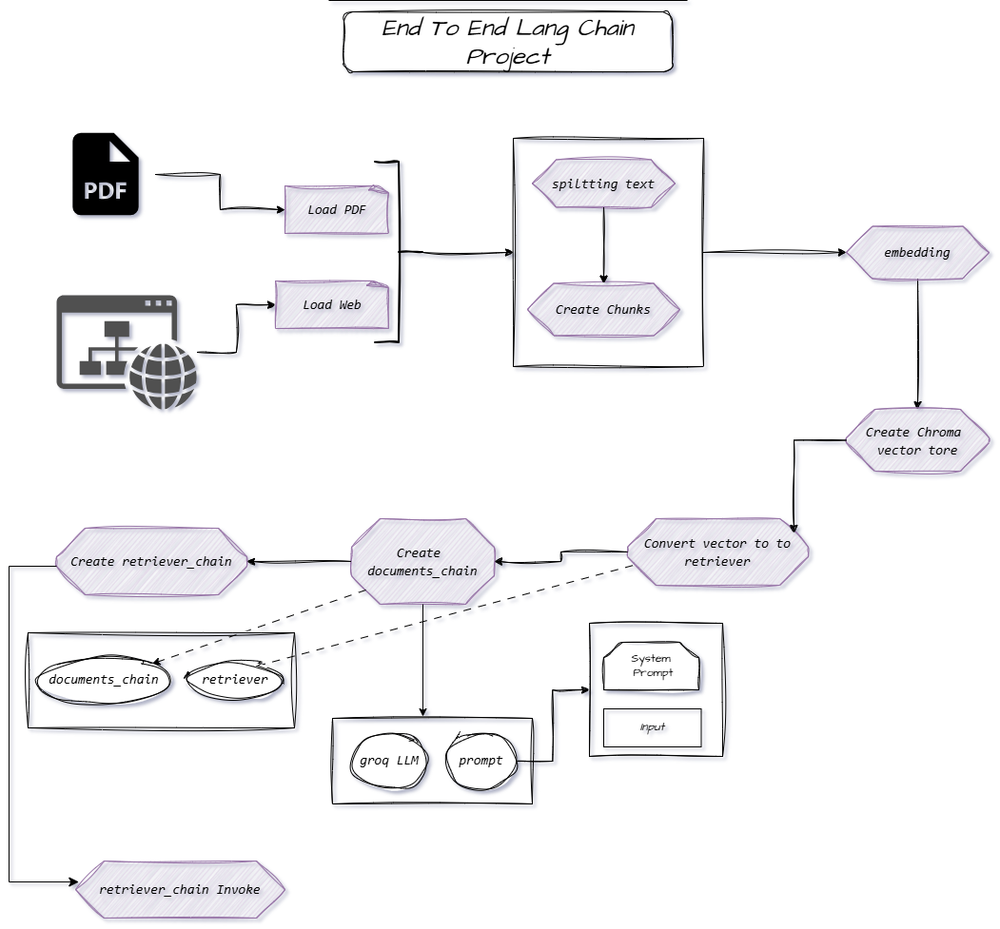

# *End To End LangChain Project*


```bash
uv init
```

```bash
uv venv  
```

```bash
.venv\Scripts\activate   
```

```bash
uv pip install  -r requirements.txt
```


```bash
streamlit run app.py
```

## *Create Docker file*  


## *Project Map -WorkFlow Visualization*

